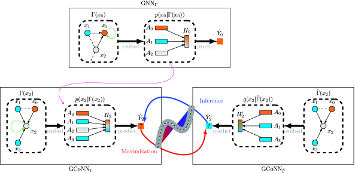

# GCoNN
This is an implementation of the [GCoNN (Graph ** Neural Networks)] model.

Table of Contents
=================
<!--ts-->
- [GCoNN](#gconn)
- [Table of Contents](#table-of-contents)
  - [Introduction](#introduction)
  - [Usage](#usage)
    - [Semi-Supervised Node Classification](#semi-supervised-node-classification)
    - [Label-scarce](#label-scarce)
    - [Node masking](#node-masking)
  - [Acknowledgement](#acknowledgement)
  - [Citation](#citation)
<!--te-->

## Introduction
Graph Neural Network is an effective architecture for semi-supervised Learning. However, data-driven mode of
graph neural network raises the problems that models suffer from the limitations of incomplete attribute learning, insufficient structure capture and indistinguishability between node attribute and neighbor information, especially on label scarce data. In this paper, we propose a novel method, named **Graph Co-Neighbor Neural Network (GCoNN)**, which learns the situation of node attribute collaborating with neighbor information. The network is composed of two modules: $GCoNN_\Gamma$, models effective node
representation and $GCoNN_{\mathring{\Gamma}}$, explores neighbor dependency. First, $GCoNN_\Gamma$ trains to establish the fundamental prototype for node representation on labeled data. Second, $GCoNN_{\mathring{\Gamma}}$ learns the neighbor dependency on unlabeled data through pseudo labels acquired by $GCoNN_\Gamma$. Third, $GCoNN_\Gamma$ re-trains to improve the ability of integration of node attribute and neighbor information by the feedback of $GCoNN_{\mathring{\Gamma}}$. Finally, iterate second and third steps until the models converge. We theoretically analysis the iteration process is a generalized expectation maximization framework which optimizing evidence lower bound by the amortised variational inference. 
<p align="middle"></p>

## Usage

Setting Python environment
```bash
export PYTHONPATH={Path to the root of GCoNN} // e.g. '/home/yf302/Desktop/Kai/GCoNN'
```

### Semi-Supervised Node Classification

```bash
sh run_semi_supervised.sh // semi-supervised leanring on cora, citeseer, and pubmed dataset.
```

### Label-scarce
```bash
sh run_label_scarce.sh // training under the label-scarce scenario with different ratios
```
### Node masking
```bash
sh run_node_masking.sh // training under the node masking scenario with different ratios
```

## Acknowledgement
Some codes of the project are from the following repo: [pygcn](https://github.com/tkipf/pygcn).

## Citation
Please consider citing the following paper if you find our codes helpful. Thank you!
```
@inproceedings{semi2023liu,
title={Semi-Supervised Mixture Learning for Graph Neural Networks with Neighbor Dependency},
author={Kai Liu, Hongbo Liu, Tao Wang, Guoqiang Hu, Tomas E Ward and C. L. Philip
Chen},
booktitle={IEEE TRANSACTIONS ON NEURAL NETWORKS AND LEARNING SYSTEMS},
pages={**},
year={**}
}
```


